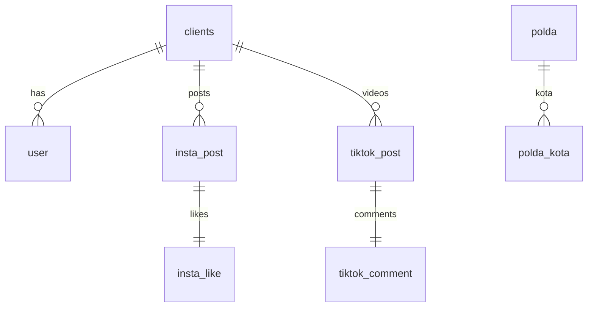

# Database Structure
*Last updated: 2025-06-18*

This document describes the main tables inside Cicero_V2 and their relationships.
The SQL schema is located at [sql/schema.sql](../sql/schema.sql) and is designed
for PostgreSQL but can work with MySQL or SQLite via the DB adapter.

## Tables

### `clients`
Represents each organisation using the system.
- `client_id` – primary key
- `nama` – organisation name
- `client_type` – text description of the type
- `client_status` – boolean, active or not
- `client_insta` / `client_tiktok` – usernames of the client accounts
- `client_operator`, `client_group`, `tiktok_secuid`, `client_super` – optional metadata

### `user`
Holds users belonging to a client.
- `user_id` – serial primary key
- `nama`, `title`, `divisi` – user info fields
- `insta`, `tiktok` – social media handles
- `client_id` – foreign key referencing `clients(client_id)`
- `status` – boolean flag

### `insta_post`
Stores Instagram posts fetched for a client.
- `shortcode` – primary key of the post
- `client_id` – foreign key to `clients`
- `caption` – post text
- `comment_count` – number of comments
- `created_at` – timestamp of the post

### `insta_like`
List of users who liked an Instagram post.
- `shortcode` – primary key and foreign key to `insta_post(shortcode)`
- `likes` – JSON array of usernames
- `updated_at` – when the like data was fetched

### `insta_profile`
Profile information for arbitrary Instagram accounts.
- `username` – primary key
- `full_name`, `biography`, `follower_count`, `following_count`,
  `post_count`, `profile_pic_url`, `updated_at`

### `tiktok_post`
Data for TikTok videos associated with a client.
- `video_id` – primary key
- `client_id` – foreign key to `clients`
- `caption`, `like_count`, `comment_count`, `created_at`

### `tiktok_comment`
Comments for a TikTok video.
- `video_id` – primary key and foreign key to `tiktok_post(video_id)`
- `comments` – JSON array of comments
- `updated_at`

### `insta_post_cache`
Caches Instagram posts fetched by username.
- `id` – serial primary key
- `username` – Instagram account
- `posts` – JSON array of posts
- `fetched_at` – when data was fetched

### `polres_insta`
Tracks official Instagram accounts for recency checks.
- `username` – primary key
- `last_post_at` – timestamp of last post
- `checked_at` – when verified

### `polda` and `polda_kota`
Reference tables of regional police divisions.
- `polda` has `id` and unique `nama`
- `polda_kota` links to `polda(id)` with an additional `nama`

### `instagram_user`
Core profile details returned from Instagram scraping.
- `user_id` – primary key
- `username`, `full_name`, `biography`
- `business_contact_method`, `category`, `category_id`, `account_type`
- `contact_phone_number`, `external_url`, `fbid_v2`
- `is_business`, `is_private`, `is_verified`
- `public_email`, `public_phone_country_code`, `public_phone_number`
- `profile_pic_url`, `profile_pic_url_hd`

### `instagram_user_about`
Additional account metadata.
- `user_id` – foreign key to `instagram_user`
- `country`, `date_joined`, `date_joined_timestamp`, `former_usernames`

### `instagram_bio_link`
Links found in the account bio.
- `user_id` – foreign key to `instagram_user`
- `link_id` – primary key per user
- `link_type`, `lynx_url`, `open_in_app`, `title`, `url`, `is_pinned`

### `instagram_profile_pic_version`
Historical profile picture versions.
- `user_id` – foreign key to `instagram_user`
- `height`, `width`, `url`

### `instagram_user_metrics`
Follower and media statistics.
- `user_id` – primary key referencing `instagram_user`
- `follower_count`, `following_count`, `media_count`
- `total_igtv_videos`, `latest_reel_media`

### `instagram_user_location`
Location information if available.
- `user_id` – primary key referencing `instagram_user`
- `address_street`, `city_id`, `city_name`
- `instagram_location_id`, `latitude`, `longitude`, `zip`

## Relationships

The diagram shows how each `client` owns many `user`, `insta_post` and
`tiktok_post` records. Instagram and TikTok posts have one-to-one tables for
likes and comments. `polda` tables are independent of client data.
