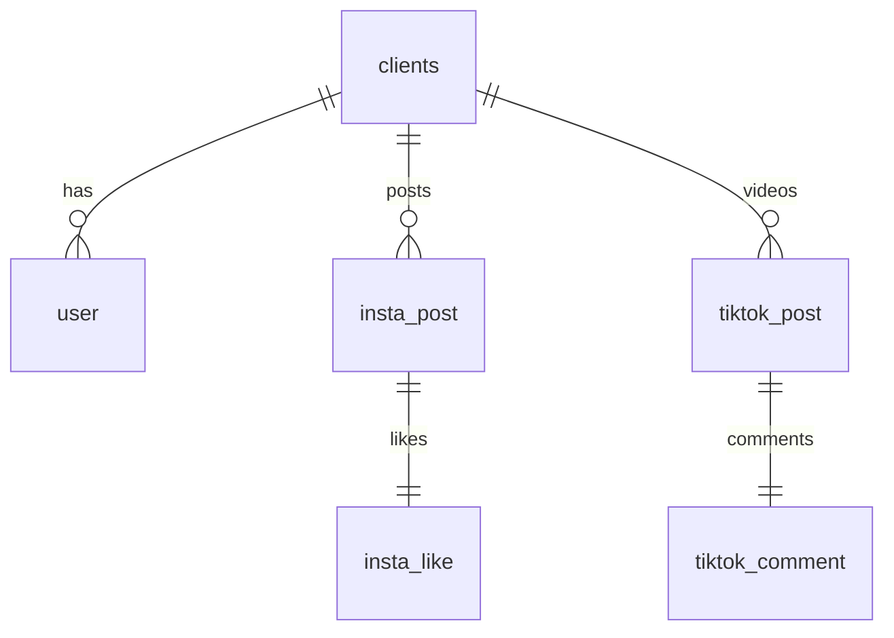

# Database Structure

*Last updated: 2025-07-18*

This document describes the main tables inside Cicero_V2 and their relationships.
The SQL schema is located at [sql/schema.sql](../sql/schema.sql) and is designed
for PostgreSQL but can work with MySQL or SQLite via the DB adapter.

## Table Overview

| Table Name | Purpose |
|------------|---------|
| clients | master table for registered organisations |
| user | members belonging to a client |
| dashboard_user | login credentials for dashboard access |
| insta_post | Instagram posts fetched for each client |
| insta_like | cached likes for an Instagram post |
| insta_comment | cached comments for an Instagram post |
| insta_profile | basic Instagram profile information |
| tiktok_post | TikTok videos fetched for each client |
| tiktok_comment | cached TikTok comments |
| instagram_user | extended Instagram account data |
| instagram_user_metrics | follower/media statistics |
| ig_ext_users | RapidAPI user reference |
| ig_ext_posts | RapidAPI post reference |
| ig_ext_media_items | media items within a post |
| ig_ext_tagged_users | tagged users inside a media item |
| ig_ext_hashtags | hashtags detected in posts |
| ig_hashtag_info | metadata for individual hashtags |
| ig_post_metrics | advanced engagement metrics |
| ig_post_like_users | relational table of likes |
| ig_post_comments | stored comments per post |
| visitor_logs | record of API access |
| login_log | history of login events |
| link_report | links submitted from the mobile app |

## Tables

### `clients`
Represents each organisation using the system.
- `client_id` – primary key
- `nama` – organisation name
- `client_type` – text description of the type
- `client_status` – boolean, active or not
- `client_insta` / `client_tiktok` – usernames of the client accounts
- `client_operator`, `client_group`, `tiktok_secuid`, `client_super` – optional metadata

### `user`
Holds users belonging to a client.
- `user_id` – primary key (NRP/NIP string)
- `nama`, `title`, `divisi` – user info fields
- `insta`, `tiktok` – social media handles
- `client_id` – foreign key referencing `clients(client_id)`
- `status` – boolean flag
- `ditbinmas`, `ditlantas` – boolean flags for directorate assignment

### `dashboard_user`
Credentials for the web dashboard login.
- `user_id` – primary key generated with `uuid.v4()`
- `username` – unique login name
- `password_hash` – bcrypt hashed password
- `role` – permission level such as `admin` or `operator`
- `status` – boolean indicating whether the account is active
- `client_id` – optional link to `clients`
- `created_at`, `updated_at` – timestamps

### `insta_post`
Stores Instagram posts fetched for a client.
- `shortcode` – primary key of the post
- `client_id` – foreign key to `clients`
- `caption` – post text
- `comment_count` – number of comments
- `thumbnail_url` – image preview
- `is_video` – boolean whether post is a video
- `video_url` – link to video file if any
- `image_url` – link to image file
- `images_url` – JSON array of all image URLs when the post is a carousel
- `is_carousel` – boolean indicating whether the post contains multiple images
- `created_at` – timestamp of the post

### `insta_like`
List of users who liked an Instagram post.
- `shortcode` – primary key and foreign key to `insta_post(shortcode)`
- `likes` – JSON array of usernames
- `updated_at` – when the like data was fetched

### `insta_profile`
Profile information for arbitrary Instagram accounts.
- `username` – primary key
- `full_name`, `biography`, `follower_count`, `following_count`,
  `post_count`, `profile_pic_url`, `updated_at`

### `tiktok_post`
Data for TikTok videos associated with a client.
- `video_id` – primary key
- `client_id` – foreign key to `clients`
- `caption`, `like_count`, `comment_count`, `created_at`

### `tiktok_comment`
Comments for a TikTok video.
- `video_id` – primary key and foreign key to `tiktok_post(video_id)`
- `comments` – JSON array of comments
- `updated_at`
### `instagram_user`
Core profile details returned from Instagram scraping.
- `user_id` – primary key
- `username`, `full_name`, `biography`
- `business_contact_method`, `category`, `category_id`, `account_type`
- `contact_phone_number`, `external_url`, `fbid_v2`
- `is_business`, `is_private`, `is_verified`
- `public_email`, `public_phone_country_code`, `public_phone_number`
- `profile_pic_url`, `profile_pic_url_hd`
- `premium_status` – boolean flag indicating active subscription
- `premium_end_date` – date the premium access expires

### `instagram_user_metrics`
Follower and media statistics.
- `user_id` – primary key referencing `instagram_user`
- `follower_count`, `following_count`, `media_count`
- `total_igtv_videos`, `latest_reel_media`


### `link_report`
  Stores social media links submitted from the mobile app.
- `shortcode` – foreign key to `insta_post`
- `user_id` – foreign key to `user`
- `shortcode` and `user_id` form the primary key
- `instagram_link`, `facebook_link`, `twitter_link`, `tiktok_link`, `youtube_link`
- `created_at` – timestamp when the report was submitted

### `login_log`
Stores login events for auditing.
- `log_id` – primary key
- `actor_id` – identifier of the user or client
- `login_type` – `operator` or `user`
- `login_source` – `web` or `mobile`
- `logged_at` – timestamp when the login occurred

## Relationships



The diagram shows how each `client` owns many `user`, `insta_post` and
`tiktok_post` records. Instagram and TikTok posts have one-to-one tables for
likes and comments.

## PostgreSQL Table Management

Use the SQL scripts inside the [`sql`](../sql) directory to create the tables:

```bash
psql -U <dbuser> -d <dbname> -f sql/schema.sql
```

To remove tables no longer in use, run `DROP TABLE` via `psql` (add `IF EXISTS`
to avoid errors):

```bash
psql -U <dbuser> -d <dbname> -c "DROP TABLE IF EXISTS old_table_name;"
```

Repeat the command for each unused table. Always ensure a recent backup exists
before dropping tables.

Refer to [docs/naming_conventions.md](naming_conventions.md) for code style guidelines.
